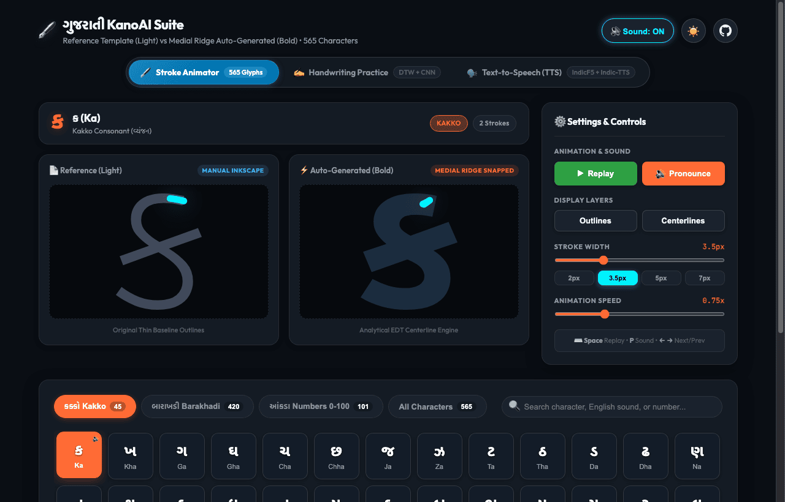
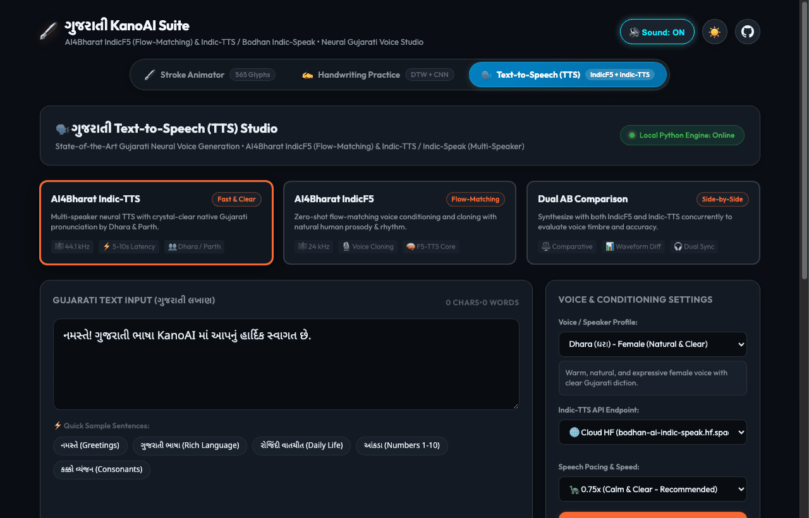
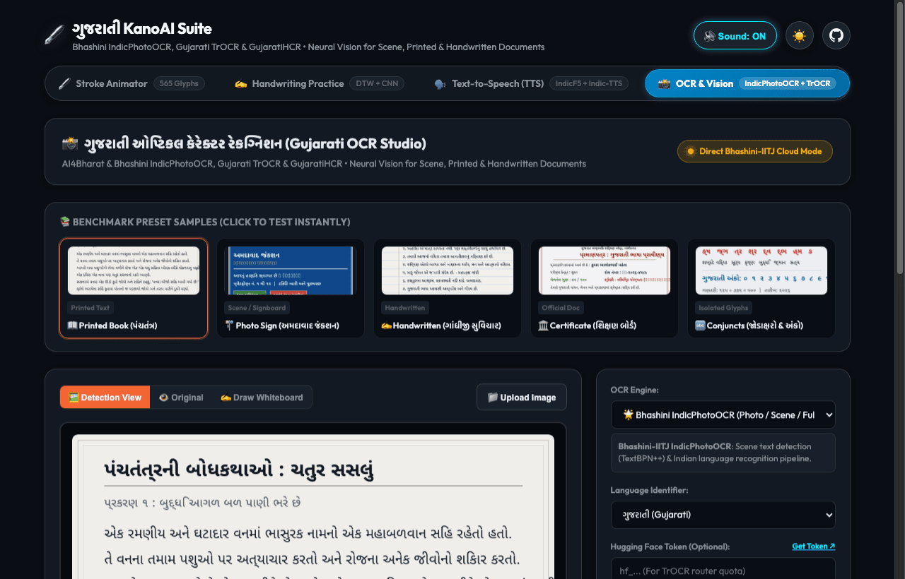
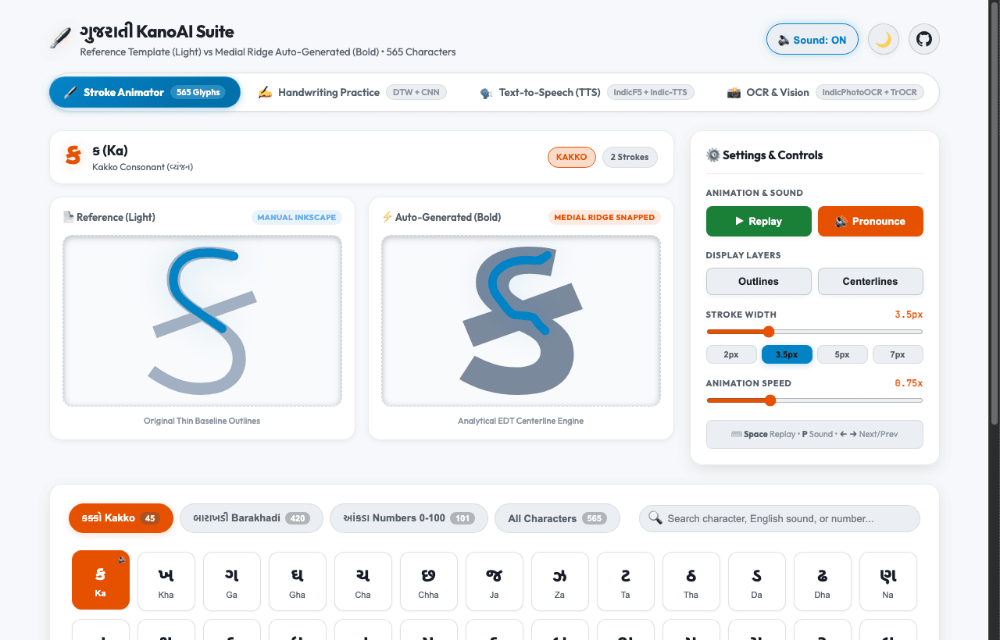

 
 [](http://www.instagram.com/gajjartejas)
[](http://www.twitter.com/gajjartejas)

# KanoAI (ગુજરાતી KanoAI Suite)

**The Comprehensive All-in-One Gujarati Language & AI Intelligence Suite.**

An open-source ecosystem bridging classical Gujarati typography, dynamic stroke animations, real-time handwriting recognition, native audio generation, Speech-to-Text (STT), Text-to-Speech (TTS), and AI grammar intelligence.

[](https://gajjartejas.github.io/KanoAI/)
[](https://gajjartejas.github.io/KanoAI/handwriting/)
[](https://gajjartejas.github.io/KanoAI/#tts)
[](https://gajjartejas.github.io/KanoAI/#ocr)

🌐 **Live Interactive Apps**:
- **🖋️ Kano Stroke Animator & Audio**: [https://gajjartejas.github.io/KanoAI/](https://gajjartejas.github.io/KanoAI/)
- **✍️ Kano Handwriting Recognition & Practice Suite**: [https://gajjartejas.github.io/KanoAI/handwriting/](https://gajjartejas.github.io/KanoAI/handwriting/)
- **🗣️ Kano Gujarati Voice (TTS) Studio**: [https://gajjartejas.github.io/KanoAI/#tts](https://gajjartejas.github.io/KanoAI/#tts)
- **📸 Kano Gujarati OCR & Vision Studio**: [https://gajjartejas.github.io/KanoAI/#ocr](https://gajjartejas.github.io/KanoAI/#ocr)

| 🖋️ Stroke Animator & Kano Audio Suite | ✍️ Handwriting Practice Suite | 🗣️ Gujarati Text-to-Speech (TTS) Studio | 📸 Gujarati OCR & Vision Studio |
| :---: | :---: | :---: | :---: |
| [](https://gajjartejas.github.io/KanoAI/) | [](https://gajjartejas.github.io/KanoAI/handwriting/) | [](https://gajjartejas.github.io/KanoAI/#tts) | [](https://gajjartejas.github.io/KanoAI/#ocr) |

---

## ⚡ Quickstart: Launch All Servers & Open Webpage

Run the one-click launcher to start the Python Unified Backend API Server (OCR + TTS on port 8000) and the Local Web Studio (port 8085), perform health checks, and automatically open the suite in your default browser:

```bash
# Using Bash (macOS / Linux):
./start_all.sh

# Or using Python (macOS / Windows / Linux):
python3 start_all.py
```

**Options & Flags:**
- `./start_all.sh --tab tts` &bull; Open directly to the Text-to-Speech (TTS) Studio (`#tts`)
- `./start_all.sh --tab ocr` &bull; Open directly to the OCR & Vision Studio (`#ocr`)
- `./start_all.sh --tab handwriting` &bull; Open directly to the Handwriting Suite (`/handwriting/`)
- `./start_all.sh --no-browser` &bull; Start servers in background without opening browser
- `./start_all.sh --api-port 8000 --web-port 8085` &bull; Custom ports

---

## 🚀 The KanoAI Ecosystem Roadmap

| Module | Status | Description |
| :--- | :---: | :--- |
| **🖋️ Kano Trace** | ✅ **Live** | Stroke-by-stroke animation, EDT centerline extraction, and 565-character stroke catalog. |
| **✍️ Kano Handwriting** | ✅ **Live** | Real-time offline recognition combining Sakoe-Chiba DTW + in-memory Tiny CNN. |
| **🔊 Kano Audio** | ✅ **Live** | Compressed, crystal-clear native speech pronunciations for all 565 characters. |
| **🗣️ Kano Voice (TTS)** | ✅ **Live** | State-of-the-art neural TTS with AI4Bharat IndicF5 & Indic-TTS / Bodhan Indic-Speak. |
| **📸 Kano Vision (OCR)** | ✅ **Live** | Multi-engine Gujarati OCR (Bhashini IndicPhotoOCR, Gujarati TrOCR, GujaratiHCR) with voice playback bridge. |
| **🎙️ Kano Listen (STT)** | 📋 **Planned** | Offline & low-latency Gujarati Speech-to-Text acoustic modeling. |
| **🧠 Kano Grammar (AI)** | 📋 **Planned** | LLM-assisted Gujarati spell-checker, grammar analysis, sandhi/samasa parser, and NLP toolkits. |
| **⚡ Kano API** | ✅ **Live** | Lightweight REST / JSON microservices for characters, strokes, phonemes, and audio synthesis. |

---

## 📁 Repository Structure

```
KanoAI/
├── .agents/                      # Antigravity AI agent skills & custom workflows (/update-markdown)
├── handwriting/                  # Real-Time Gujarati Handwriting Recognition & Practice Workspace
│   ├── src/                      # Canvas, Guided Tracing, Quiz, Free Draw, Hybrid DTW + Tiny CNN
│   ├── __tests__/                # Automated test suites (30 tests)
│   ├── scripts/                  # Template extraction & model generation scripts
│   ├── package.json              # TypeScript, React Native Web, Expo, and Jest runners
│   └── README.md                 # Full technical spec & architecture documentation
├── node/                         # Node.js resource generation workspace
│   ├── package.json              # Dependencies (text-to-svg, node-fetch)
│   ├── index.js                  # Static SVG, CSV, and TTS audio generator
│   └── README.md                 # Node.js documentation and usage instructions
├── python/                       # Python workspace
│   ├── setup_venv.sh             # Industry-standard virtual environment setup script
│   ├── README.md                 # Python workspace overview & venv instructions
│   ├── ocr/                      # Multi-Engine Gujarati OCR Studio (IndicPhotoOCR, TrOCR, GujaratiHCR)
│   ├── tts/                      # Neural Gujarati Voice Studio (IndicF5 & Indic-TTS)
│   ├── tests/                    # Comprehensive unit tests for OCR, TTS, APIs & services
│   └── char_stroke_generation/   # Dedicated character stroke generation package
│       ├── stroke_generator/     # Core library (Bézier, EDT, HarfBuzz, IoU matching)
│       ├── scripts/              # Standalone CLI runners
│       ├── tests/                # Automated unit tests
│       ├── pyproject.toml        # PEP 621 packaging
│       ├── requirements.txt      # Pip dependencies
│       └── README.md             # Technical documentation & math formulations
├── docs/                         # Live GitHub Pages interactive frontend & Kano audio suite
│   ├── index.html                # Semantic responsive single-page web application
│   ├── css/                      # Modular styling (main, stage comparison, ocr, character grid)
│   ├── js/                       # Stage renderer, Kano audio player, OCR studio, app coordinator
│   ├── assets/                   # Full 565-character SVG catalog, OCR sample documents & previews
│   └── handwriting/              # Production web build for the Handwriting Recognition Suite
├── scripts/                      # Launchers (start_all.sh/py), test runners (run_tests.sh/py) & asset tools
├── start_all.sh                  # One-click suite launcher (Bash)
├── start_all.py                  # One-click suite launcher (Python)
├── fonts/                        # Shared TrueType/OpenType Gujarati fonts
├── resources/                    # Shared JSON definitions & raw datasets (Kakko, Barakhadi, Numerals)
├── interpolate-svg/              # Manual reference SVG stroke templates
├── output/                       # Generated SVG artifacts & preview catalogs (.gitignored)
└── .github/workflows/            # GitHub Actions automated GitHub Pages deployment workflow
```

---

## 🌐 Live Interactive Frontend & Kano Audio Suite (`docs/`)

🔗 **Live Production Demo**: [https://gajjartejas.github.io/KanoAI/](https://gajjartejas.github.io/KanoAI/)

The live web application provides an interactive stroke animator and audio player:
- **All 565 Gujarati Characters**: Complete Kakko (45), full Barakhadi (420 across 35 consonants), and Numerals 0–100 (101).
- **Normalized 1:1 Stage Sizing**: Explicit `viewBox` coordinate normalization ensuring Reference (Light) and Auto-Generated (Bold) comparison cards scale with equal proportions and perfect centering.
- **Dedicated Settings Panel**: Right-side desktop dock with quick playback controls, layer toggles, speed adjustments, and keyboard shortcuts.
- **Dynamic Stroke Width Options**: Interactive slider (1px to 10px) with live preset pills (`2px`, `3.5px`, `5px`, `7px`) modifying both stages in real-time.
- **Kano Audio Pronunciations**: Speech pronunciations for all 565 characters, compressed via `ffmpeg` to high-efficiency MP3s, featuring auto-play on selection, dedicated `🔊 Pronounce` button, and persistent `Sound: ON/OFF` toggle.
- **Dark / Light Theme Toggle**: Top-right switch with Sun/Moon icons, custom HSL color palettes, and `localStorage` memory.
- **Mobile Responsive Design**: Clean side-by-side stages, compact slider grids, and touch-optimized character targets on mobile viewports.
- **Zero-Click GitHub Pages Deployment**: Fully automated via [`.github/workflows/deploy-pages.yml`](.github/workflows/deploy-pages.yml).

### 🖥️ Stroke Animator & Audio Previews

| Dark Theme (Default) | Light Theme |
| :---: | :---: |
| [](https://gajjartejas.github.io/KanoAI/) | [](https://gajjartejas.github.io/KanoAI/?theme=light) |

---

## ✍️ Real-Time Gujarati Handwriting Recognition & Practice Suite (`handwriting/`)

🔗 **Live Handwriting Web App**: [https://gajjartejas.github.io/KanoAI/handwriting/](https://gajjartejas.github.io/KanoAI/handwriting/)

A complete handwriting recognition and practice suite featuring:
- **Guided Practice**: Step-by-step Gujarati character tracing with directional hints, sequential stroke bubbles, and instant feedback.
- **Animated Player**: Interactive stroke-by-stroke playback of all 565 characters with speed controls and printable worksheet generator.
- **Quiz Game**: Gamified learning pairing Gujarati vocabulary, native audio pronunciation, and interactive drawing challenges.
- **Free Drawing & Recognition**: Multi-stroke canvas powered by a **Hybrid Recognition Engine** combining **Sakoe-Chiba Dynamic Time Warping (DTW)** and an in-memory **Tiny CNN (Conv2D/MaxPool/Dense)** classifier.
- **Accuracy Benchmarks**: Automated performance testing verifying sub-20ms latency and high recognition accuracy across characters.

### 🖥️ Handwriting Suite Preview

[](https://gajjartejas.github.io/KanoAI/handwriting/)

```bash
cd handwriting
npm install
npm test            # Run all 7 Jest test suites (30 tests)
npm run web         # Launch local development server
npm run build:web   # Export production bundle to docs/handwriting
```
👉 See [Handwriting Documentation (`handwriting/README.md`)](handwriting/README.md) for architecture details.

---

## 🗣️ Gujarati Text-to-Speech (TTS) Studio (`python/tts/`)

State-of-the-Art Gujarati Neural Voice Generation integrating 100% offline local models and AI4Bharat architectures:

1. **Meta MMS-TTS (`facebook/mms-tts-guj`)** ★ **100% Offline & Local**:
   - **Architecture**: End-to-end Variational Inference with Adversarial Learning (VITS, 16,000 Hz).
   - **Execution**: 100% offline and local inference on Apple Silicon MPS, NVIDIA CUDA, or CPU with zero cloud rate limits.
   - **Capabilities**: High-fidelity isolated consonant, syllable, Barakhadi, and numeral synthesis with automated verbalization (`૧` → `એક`, `૧૦` → `દસ`).
2. **AI4Bharat IndicF5** ([GitHub](https://github.com/AI4Bharat/IndicF5) / [HuggingFace](https://huggingface.co/ai4bharat/IndicF5)):
   - **Architecture**: Flow-matching diffusion-style voice synthesis (24,000 Hz).
   - **Capabilities**: Zero-shot voice conditioning, reference mimicking with Kano audio, high human prosody.
3. **AI4Bharat Indic-TTS / Bodhan-AI Indic-Speak** ([GitHub](https://github.com/AI4Bharat/Indic-TTS) / [HuggingFace](https://huggingface.co/bodhan-ai/indic-speak)):
   - **Architecture**: Multi-speaker fast neural acoustic model (44,100 Hz).
   - **Capabilities**: Preset native Gujarati speaker profiles (`Dhara` - Female, `Parth` - Male), sub-5s synthesis latency.

### 🖥️ TTS Studio Preview

[](https://gajjartejas.github.io/KanoAI/#tts)

### 🚀 Running the TTS API Server & Web Studio

```bash
# 1. Start the lightweight TTS HTTP API server (port 8000)
.venv/bin/python3 python/tts/server.py --port 8000

# 2. Open the web studio in docs/ or via local server
python3 -m http.server 8085 --directory docs
# Navigate to: http://localhost:8085/#tts
```

### 🎙️ Standalone Batch Audio Generator (`python/audio_generation/`)

Dedicated offline batch pronunciation generator for Kakko, Barakhadi series, and numerals with optional FFmpeg MP3 compression:

```bash
# 1. Run pronunciation benchmark across sample isolated characters & numerals:
.venv/bin/python3 python/audio_generation/generate_tts_local.py --benchmark

# 2. Synthesize custom Gujarati text directly to MP3:
.venv/bin/python3 python/audio_generation/generate_tts_local.py --text "કક્કો" --output out.mp3 --format mp3

# 3. Batch generate isolated Kakko consonants (WAV or MP3):
.venv/bin/python3 python/audio_generation/generate_tts_local.py --category kakko --output-dir output/tts/kakko --format mp3

# 4. Batch generate numerals (૧ to ૧૦૦):
.venv/bin/python3 python/audio_generation/generate_tts_local.py --category numerals --output-dir output/tts/numerals --format mp3
```

### 💻 TTS Command Line Interface (CLI)

```bash
# Synthesize with Meta MMS-TTS (Offline VITS)
.venv/bin/python3 python/tts/cli.py --engine mms_tts --text "નમસ્તે KanoAI" --output output/tts/mms.wav

# Synthesize with Indic-TTS (Dhara)
.venv/bin/python3 python/tts/cli.py --engine indic_tts --text "નમસ્તે KanoAI" --output output/tts/dhara.wav

# Synthesize with IndicF5
.venv/bin/python3 python/tts/cli.py --engine indic_f5 --text "નમસ્તે KanoAI" --output output/tts/f5.wav

# Multi-engine side-by-side comparison
.venv/bin/python3 python/tts/cli.py --compare --text "ગુજરાતી ભાષા ખૂબ જ સુંદર છે."

# Run automated test suite
.venv/bin/python3 python/tts/cli.py --test
```

---

## 📸 Gujarati OCR & Vision Studio (`python/ocr/`)

Multi-Engine Gujarati Optical Character Recognition (OCR) covering printed literature, official scanned certificates, camera scene text / signboards, and handwritten notebook pages.

1. **Bhashini-IITJ IndicPhotoOCR** ([GitHub](https://github.com/Bhashini-IITJ/IndicPhotoOCR) / [HuggingFace Space](https://huggingface.co/spaces/Bhashini-IITJ/IndicPhotoOCR)):
   - **Architecture**: DBNet Text Detector + Indic Multilingual Sequence Recognition.
   - **Best For**: Natural scene text, street signs, posters, and full page document localization with bounding box coordinates.
2. **Gujarati TrOCR** ([HuggingFace](https://huggingface.co/umangchaudhari/gujarati-ocr)):
   - **Architecture**: Vision Transformer (TrOCR) encoder-decoder trained on Gujarati typography and conjuncts.
   - **Best For**: Scanned books and printed literature (**96.2% exact word accuracy, 1.35% CER**).
3. **GujaratiHCR Research Pipeline**:
   - **Architecture**: Adaptive binarization, horizontal/vertical projection profiling for line/word segmentation, contour isolation, and CNN-LSTM recognition.
   - **Best For**: Cursive Gujarati handwriting, ruled notebook pages, and individual handwritten characters.

### 🖥️ OCR Studio Preview

[](https://gajjartejas.github.io/KanoAI/#ocr)

### 🚀 Running the Unified OCR & TTS Backend Server

```bash
# 1. Start the unified OCR & TTS HTTP API server (port 8000)
.venv/bin/python3 python/ocr/server.py --port 8000

# 2. Open the web studio in docs/ or via local server
python3 -m http.server 8085 --directory docs
# Navigate to: http://localhost:8085/#ocr
```

### 💻 OCR Command Line Interface (CLI)

```bash
# Recognize scene photo or document with Bhashini IndicPhotoOCR
.venv/bin/python3 python/ocr/cli.py --image docs/assets/ocr_samples/sample_1_printed_book.png --engine indic_photo_ocr

# Recognize printed document with Gujarati TrOCR
.venv/bin/python3 python/ocr/cli.py --image docs/assets/ocr_samples/sample_4_official_doc.png --engine gujarati_trocr

# Run Handwriting HCR line segmentation
.venv/bin/python3 python/ocr/cli.py --image docs/assets/ocr_samples/sample_3_handwritten_note.png --engine gujarati_hcr

# Compare all 3 OCR engines side-by-side
.venv/bin/python3 python/ocr/cli.py --image docs/assets/ocr_samples/sample_1_printed_book.png --compare

# Run OCR automated self-test
.venv/bin/python3 python/ocr/cli.py --test
```
👉 See [OCR Documentation (`python/ocr/README.md`)](python/ocr/README.md) for full API specifications.

---

## 🧪 Automated Unit Testing & CI Verification (`python/tests/`)

The KanoAI suite includes a comprehensive Python unit test suite verifying OCR, TTS, API request handlers, image segmentation, and system launchers:

### 🚀 Running All Tests

```bash
# Run using the automated shell test runner (macOS / Linux):
./scripts/run_tests.sh

# Or run using the cross-platform Python runner:
python3 scripts/run_tests.py

# Or directly with Python standard library unittest:
PYTHONPATH=python python3 -m unittest discover -s python/tests -p "test_*.py" -v
```

### 📋 Test Coverage Matrix (37 Tests)

| Component | Test Module | Description |
| :--- | :--- | :--- |
| **📸 OCR Service Coordinator** | `test_ocr_service.py` | Multi-engine routing (`indic_photo_ocr`, `gujarati_trocr`, `gujarati_hcr`), automatic fallback chain, sample catalog schema, comparison mode. |
| **✍️ GujaratiHCR Segmentation** | `test_ocr_hcr.py` | Grayscale & Otsu binarization, horizontal/vertical projection slicing, normalized bounding box coordinates (`norm_x`, `norm_y`, `norm_w`, `norm_h`), network timeout fallback. |
| **📖 Gujarati TrOCR** | `test_ocr_trocr.py` | Multi-line document contour slicing, input formats (PIL, NumPy, base64 data URIs, files), Hugging Face router & local server mocks. |
| **⚡ OCR Server API** | `test_ocr_server.py` | HTTP microservice endpoints (`/api/health`, `/api/ocr/samples`, `/api/ocr/recognize`, `/api/ocr/compare`), CORS preflight OPTIONS, 400 Bad Request handling. |
| **🗣️ TTS Service Coordinator** | `test_tts_service.py` | Unified preset catalogue, dual-engine voice routing (`indic_f5`, `indic_tts`), side-by-side comparison synthesis, speaker registry. |
| **🎙️ Neural TTS Engines** | `test_tts_engines.py` | `IndicF5Engine` and `IndicTTSEngine` parameter validations, empty input assertions, base64 audio payload encoding, speaker profiles (`Dhara`, `Parth`). |
| **⚡ TTS Server API** | `test_tts_server.py` | HTTP microservice endpoints (`/api/health`, `/api/tts/voices`, `/api/tts/synthesize`, `/api/tts/presets`), CORS headers, malformed payload recovery. |
| **🚀 System Launchers** | `test_launcher.py` | Cross-platform port availability check (`is_port_in_use`), health check wait loop (`wait_for_url`), repository root path resolution. |

---

## 🟢 Node.js Workspace (`node/`)

Used for rendering standard glyph SVGs, CSV matrices, and Google Wavenet audio files.

```bash
cd node
npm install
node index.js
```
👉 See [Node.js Documentation (`node/README.md`)](node/README.md) for details.

---

## 🐍 Python Workspace: Character Stroke Generation (`python/`)

An analytical geometry and Euclidean Distance Transform (EDT) pipeline to automatically extract medial centerline strokes from Gujarati fonts for the **Kano** React Native educational app.

### Quick Start (Industry-Standard Virtual Environment Setup)

```bash
# 1. Run automated environment setup (creates .venv & installs dependencies)
./python/setup_venv.sh

# 2. Activate virtual environment
source .venv/bin/activate

# 3. Run automated unit tests
PYTHONPATH=python/char_stroke_generation python -m unittest discover -s python/char_stroke_generation/tests -t python/char_stroke_generation

# 4. Generate 56 showcase samples and launch interactive viewer
python python/char_stroke_generation/scripts/build_samples.py
python python/char_stroke_generation/scripts/build_viewer.py --serve 8765
```

👉 See [Python Workspace (`python/README.md`)](python/README.md) and [Stroke Generation Guide (`python/char_stroke_generation/README.md`)](python/char_stroke_generation/README.md) for details.

---

## 📚 Character Dataset & Catalog
 
The KanoAI suite catalogs and interactively supports **565 total characters**:
- **Kakko (45)**: Complete Gujarati vowels (સ્વર) and consonants (વ્યંજન).
- **Barakhadi (420)**: Comprehensive matra combinations across 35 consonants.
- **Numerals (101)**: Gujarati digits and numbers `૦` to `૧૦૦` (0–100) with complete transliterations and names.

Full structured JSON datasets and definitions are located in [`resources/`](resources/):
- [`resources/kakko.json`](resources/kakko.json)
- [`resources/barakhadi.json`](resources/barakhadi.json)
- [`resources/gujarati-numbers.json`](resources/gujarati-numbers.json)

All characters can be interactively browsed, animated, pronounced, and practiced in the [Live Suite](https://gajjartejas.github.io/KanoAI/).

---


## 🗺️ Roadmap & Upcoming Milestones

- [x] **Kano Trace**: 565-character stroke animation & analytical EDT centerline extraction.
- [x] **Kano Handwriting**: Dual DTW + Tiny CNN offline recognition engine (<20ms latency).
- [x] **Kano Voice (TTS)**: Neural Gujarati speech synthesis model (AI4Bharat IndicF5 & Indic-TTS / Bodhan-AI Indic-Speak) with smooth 60fps waveform sync.
- [x] **Kano Vision (OCR)**: Multi-engine Gujarati OCR studio (Bhashini-IITJ IndicPhotoOCR, Gujarati TrOCR, GujaratiHCR) with voice playback bridge.
- [ ] **Kano Listen (STT)**: Offline Speech-to-Text engine optimized for regional accents.
- [ ] **Kano Grammar AI**: Contextual spell-checker, Sandhi/Samasa decomposition, and morphological analysis.
- [ ] **Kano Cloud API**: Developer REST/GraphQL endpoints for character stroke vectors, phonetics, and datasets.

---

## 🙏 Third-Party Credits & Acknowledgements

KanoAI proudly stands on the shoulders of the open-source and scientific research communities. We gratefully acknowledge the following projects, models, datasets, and libraries:

### 🧠 Neural AI Models & Machine Learning Research
- **[Meta MMS-TTS](https://huggingface.co/facebook/mms-tts-guj)** (Meta AI Research): Scaling Speech Technology to 1,000+ languages; Variational Inference with Adversarial Learning (VITS) Gujarati neural speech checkpoint (`facebook/mms-tts-guj`).
- **[AI4Bharat IndicF5](https://github.com/AI4Bharat/IndicF5)** (IIT Madras & AI4Bharat): Reference-conditioned Flow-Matching Speech Synthesis for Indian languages ([Hugging Face Space](https://huggingface.co/ai4bharat/IndicF5)).
- **[AI4Bharat Indic-TTS](https://github.com/AI4Bharat/Indic-TTS)** (IIT Madras & AI4Bharat): Multi-speaker neural text-to-speech acoustic models for Indian languages ([Hugging Face](https://huggingface.co/ai4bharat/indic-parler-tts)).
- **[Bodhan AI (Indic-Speak)](https://huggingface.co/bodhan-ai/indic-speak)**: Natural Gujarati female (`Dhara`) and male (`Parth`) neural speaker profiles.
- **[Bhashini-IITJ IndicPhotoOCR](https://github.com/Bhashini-IITJ/IndicPhotoOCR)** (Digital India Bhashini & IIT Jodhpur): Scene text detection (DBNet) and multilingual Indic sequence recognition ([Hugging Face Space](https://huggingface.co/spaces/Bhashini-IITJ/IndicPhotoOCR)).
- **[Gujarati TrOCR](https://huggingface.co/umangchaudhari/gujarati-ocr)** by Umang Chaudhari: Vision Transformer (ViT + RoBERTa) encoder-decoder fine-tuned specifically for Gujarati text and conjuncts.
- **[Microsoft TrOCR](https://github.com/microsoft/unilm/tree/master/trocr)** (Microsoft Research): Transformer-based Optical Character Recognition architecture for document processing.

### 🔤 Open-Source Fonts & Typography
- **[Google Noto Fonts](https://fonts.google.com/noto/specimen/Noto+Sans+Gujarati)**: Noto Sans Gujarati and Noto Serif Gujarati by Google Fonts and the Monotype design team (SIL Open Font License).
- **Gujarati Open-Source Typefaces**: Rasa, Mogra, Shrikhand, Padauk, and Anek Gujarati created and published under the SIL Open Font License (OFL).

### 🛠️ Core Libraries & Open-Source Software
- **[OpenCV (cv2)](https://opencv.org/)**: Real-time computer vision, Otsu adaptive thresholding, morphological filtering, and contour extraction.
- **[PyTorch](https://pytorch.org/) & [Hugging Face Transformers](https://huggingface.co/docs/transformers)**: Tensor processing, tokenizer runtime, and neural inference pipelines.
- **[Gradio Client](https://www.gradio.app/docs/python-client)**: Asynchronous event-driven streaming client for neural inference endpoints.
- **[Pillow (PIL)](https://python-pillow.org/)**: Raster image processing and format decoding.
- **[SoundFile](https://python-soundfile.readthedocs.io/) & [NumPy](https://numpy.org/)**: High-performance numerical computing and WAV audio serialization.
- **[React Native Web](https://necolas.github.io/react-native-web/) & [Expo](https://expo.dev/)**: Multi-platform web application runtime for the handwriting practice suite.
- **[Jest](https://jestjs.io/)**: Fast and delighting JavaScript testing framework.
- **[Simple Icons](https://simpleicons.org/) & [Lucide Icons](https://lucide.dev/)**: High-quality SVG brand icons and clean UI vectors.

---

## 📄 License

KanoAI is licensed under the [GNU GENERAL PUBLIC LICENSE](https://github.com/gajjartejas/KanoAI/blob/main/LICENSE).
